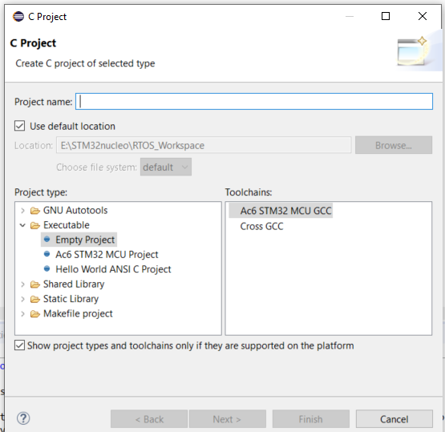
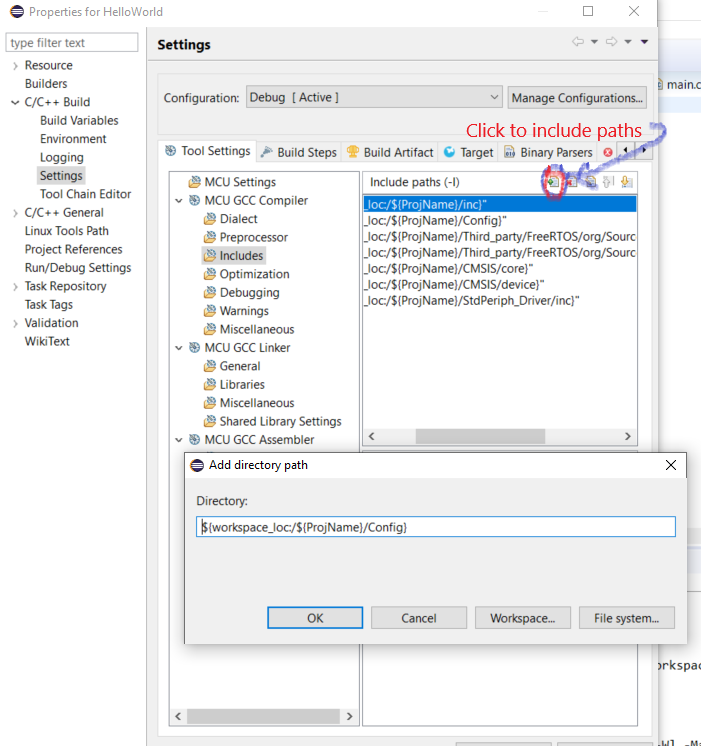

# RTOS_FreeRtos
Mastering Free RTOS using STM32F446RE

### Prerequisites
- Familiarity with STM32 IDEs
- Open minded to read and do installations on your own

## I. Gathering Files and Softwares 

- Download [FreeRTOS](https://www.freertos.org/)
- Download [STM Workbench](https://www.openstm32.org/HomePage)
- Download [Standard Peripheral Files](./StdPeri_files) { Included in the repository}

## II. Create a New project in Workbench

1.		Create a WorkSpace and select the workspace as the stm32 workbench loads.
2.		Create a New project as per the following image
	 
3.		Select following
		- Project type 		: Empty Project
		- Toolchains 		: Ac6 STM32 MCU GCC
		- Next - > Next ->
		- Board : select correct board which you are using. I use STM32F446RE
		- Next ->
		- No Firmware (If you know to include Std Periph from that option, Great! I couldnt get it working)
		- Finish
	

4.		Delete these from the Project folder (i) inc	(ii) src (iii) startup
		Copy (i) inc	(ii) src (iii) startup (iv) CMSIS (v) StdPeriph_Driver to the Project folder from StdPeriph_files folder
5.		Right click on each folder in the project -> select `properties` -> 
		under `C/C++ Build` -> Uncheck `Exclude resource from build` if checked.
6.		Right click on project -> select `properties` -> under `C/C++ Build` -> `Settings` ->
		`MCU GCC Compiler` -> `Includes`		(See following image) 
		add inc,config,CMSIS/core,CMSIS/device/,StdPeriph_Driver/inc  by selecting workspace and navigating it by yourself.
	
7.	**Creating empty RTOS project with necessary files :**
		Create folders as per following Tree

		├───CMSIS
		│   ├───core
		│   └───device
		├───Config (create this folder)
		├───inc
		├───src
		├───startup
		├───StdPeriph_Driver
		│   ├───inc
		│   └───src
		└───Third_party (create this folder)
		    └───FreeRTOS (create this folder)
		        └───org (create this folder)
		            ├───License (Copy from FreeRTOS)
		            └───Source (Copy from FreeRTOS)
		                ├───include
		                └───portable
		                    ├───GCC		(Keep just these)
		                    │   └───ARM_CM4F (Keep only what is needed)
		                    └───MemMang (Keep just these)

## III. Build
### Common Build Errors
* File not found: 
	1.		See if includes are proper, whether any folders are exculded from build.
	2.		check if your environmental variable PATH is having Arm gcc compiler path
			*How to?* : open cmd; type "arm-none-eabi-gcc" ; It should say no imput file; 
			Not 'command not found'  
	3.		Check if any files show error when you open in editor, if so resolve.
	4. 		One Interesting error i faced: #include <stdio.h> not recognised 
			Solution: Either reinstall the compiler OR
			What I did: cmd type:"where arm-none-eabi-gcc"; 
			Go to location-> one folder backwards -> look for arm-none-eabi/include -> see if 
			stdio.h is there. (It should be else reinstall.) Add this path to the environment 
			variable PATH; (Sometimes only this works) Alternatively edit:
			Project properties-> C/C++ Build -> Environment -> PATH ;
			Analyse and correct this path. Please have a backup of the PATH before editing.

---
### Miscellaneous

- should have Arm compiler if not refer [here](https://www.youtube.com/watch?v=qWqlkCLmZoE) and download link is [here](https://developer.arm.com/tools-and-software/open-source-software/developer-tools/gnu-toolchain/gnu-rm/downloads)

- [Markdown Cheat Sheet](markdown-cheat-sheet.md)