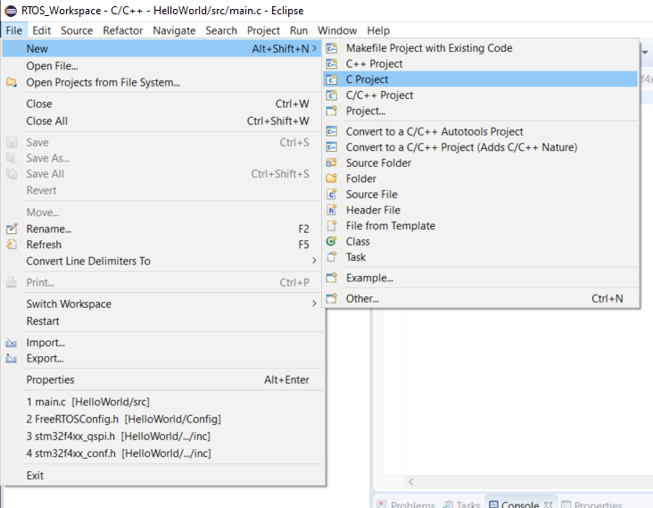

# RTOS_FreeRtos
Mastering Free RTOS using STM32F446RE

### Prerequisites
- Familiarity with STM32 IDEs
- Open minded to read and do installations on your own
- 

## 1. Gathering Files and Softwares 

- Download [FreeRTOS](https://www.freertos.org/)
- Download [STM Workbench](https://www.openstm32.org/HomePage)
- Download [Standard Peripheral Files](./StdPeri_files) { Included in the repository}

## 2. Create a New project in Workbench

1. 		Create a WorkSpace and select the workspace as the stm32 workbench loads.
2.		Create a New project as per the following img
		 
3.	

---
### Miscellaneous

[Markdown Cheat Sheet](markdown-cheat-sheet.md)